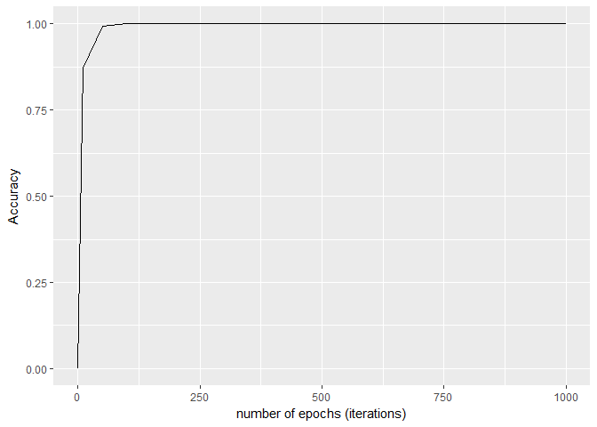
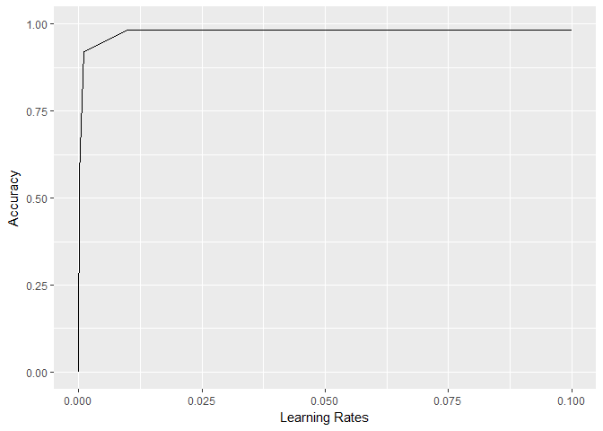
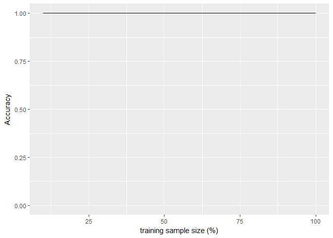

##Multiclass classification with Perceptron   

  Perceptron is the simplest form of an artificial neural network. Artificial Neural Networks (ANNs) are inspired from biological interconnection of neurons or nerve cells in animals. Perceptron imitates working of a single neuron. It was invented by Frank Rosenblatt in 1957. Perceptron is a  supervised learning algorithm which can be used for binary as swell as multiclass classification. As it involves only one layer of neuron, it is also known as single layer Perceptron.

### Objective
*__Primary:__* Implementing and evaluating a machine learning algorithm from scratch. Programming from scratch is an efficient and time-tested strategy to understand the nitty gritties of any algorithm. This is especially true in case of ML algorithms. Perceptron, widely known as the predecessor to modern day deep learning neural networks, is implemented here in R programming language without the use of any ML packages. Even the evaluation is done without use of any available measurement packages.   
*__Secondary:__* Perceptron is used to classify between 3 different classes of owls. This nocturnal bird is quite an unusual choice for the task, but also an interesting one! Features like body-length, wing-length, body-width, wing-width are used to classify between three categories: Barn Owl, Snowy Owl & Long-Eared Owl. An owl is perched at hte top of food chain and thus significant in keeping check on rodent population which is directly linked to agricultural produce. Classification of owls plays an important role in their conservation and so it forms an useful problem.

### Design of multiclass Perceptron
The rudimentary design of a perceptron capable of classifying multiple classes of owls is as follows:


Important terminology considered while designing Perceptron:
*__Synaptic Weights:__*
The connections between neurons are known as synapses. Each input feature has a corresponding weight associated with it. Output class for every set of inputs is decided based on weighted sum of the inputs. We calculate the dot product of weight vector (w) with feature vector(X) to obtain this weighted sum. 
f(x)= w.x

*__Activation function:__*
An activation function is used to fire a neuron based on inputs, in order to produce an output signal. Heaviside step function or the unit step function has been employed as the activation (transfer) function in Perceptron algorithm. It is a discontinuous function that outputs +1 for +ve argument and -1 for -ve argument.

*__Learning Rate:__*
Optimum values of synaptic weights are achieved by training Perceptron by gradient descent. Learning rate denotes the step size during gradient descent. This parameter  decides how fast or slow does the Perceptron learn from training samples. Ideally, this parameter is tuned to attain a value that is high enough for Perceptron to make a nearly accurate guess about outcome and low enough that algorithm converges in fewer iterations to a meaningful predictor.

*__Epochs:__*
A perceptron is trained through multiple passes over training dataset. Each pass over training dataset is referred to as an epoch.  Number of iterations or epochs need to be tuned in order to let the algorithm learn sufficiently from the training instances.   

*__Perceptron Online Learning:__*
Perceptron is a linear classification algorithm in the sense that it forms linear hypothesis function of synaptic weights and features. Important steps in learning are outlined as below:


### Import dataset

```r
dfOwls <- readr::read_csv("owls15.csv")
print(dfOwls)
```

```
## # A tibble: 134 x 5
##      `3`   `5` `1.6` `0.2` LongEaredOwl
##    <dbl> <dbl> <dbl> <dbl>        <chr>
##  1   3.2   4.7   1.6   0.2 LongEaredOwl
##  2   3.4   4.6   1.4   0.3 LongEaredOwl
##  3   3.6   5.0   1.4   0.2 LongEaredOwl
##  4   4.1   5.2   1.5   0.1 LongEaredOwl
##  5   3.0   4.9   1.4   0.2 LongEaredOwl
##  6   3.3   5.1   1.7   0.5 LongEaredOwl
##  7   3.4   4.8   1.6   0.2 LongEaredOwl
##  8   3.7   5.1   1.5   0.4 LongEaredOwl
##  9   3.1   4.9   1.5   0.1 LongEaredOwl
## 10   3.6   4.6   1.0   0.2 LongEaredOwl
## # ... with 124 more rows
```
It is noted that observations are not random, but classwise (recordss of once class of owl followed by other). This lack of variability can cause issues while Perceptron tries to form a hypothesis. So, we randomly shuffle the order of observations few times.


```r
#Randomly shuffle the dataset rows (repeatedly shuffled for 5 times)
rows_count <- nrow(dfOwls)
for(k in 1:5){
  dfOwls<-dfOwls[sample(rows_count),]
}
```

### Load the helper files

```r
source("Perceptron.r")
source("Evaluation_Cross_Validation.r")
source("Evaluation_Validation.r")
source("Evaluation_Curves.r")
```

### Splitting the dataset into train-test
As a good practice, the algorithm is to be tested over an unseen set of data (Validation set), that is held out until training and crossvalidation is completed. This set of data is held out initially.


```r
#Hold out 1/3 rd validation dataset
validation_instances <- sample(nrow(dfOwls)/3)
dfOwls_validation<-dfOwls[validation_instances,] #1/3 rd validation set
dfOwls_train <- dfOwls[-validation_instances,] #2/3 rd training set
```
### Train and evaluate the model:
<span style="color:red">Note: Definitions of all the functions invoked here can be found in the accompanying R project</span>
#### 1. Design the model:

```r
#Set number of epochs (iterations)
num_of_epochs <- 100 #Ideally, run with 1000 number of epochs but 1000 takes considerable amount (>10 min) to train
#Build Perceptron Model with a preliminary learning rate of 0.01
p_model <- Perceptron(0.01)
```
#### 2. Hyperparameter tuning:
Learning curves proved useful while deciding values of various hyper-parameters and adequacy of training sample size.

*__1. Number of epochs:__*
Upon trying various values of number of iterations, it was observed that accuracy increased with increasing number of iterations. However, training time also increased with number of iterations and so number of epochs was fixed at 1000 in order to achieve a trade-off between training time and accuracy

```r
#plot Learning Curve - Accuracy vs Number of Epochs (Iterations)
plot_learning_curve_epochs(p_model, dfOwls_train, dfOwls_validation)
```

<!-- -->

*__2. Learning Rate:__*
Highest accuracy was observed around value of 0.01 for learning rate. Accuracy seemed to be decreasing as learning was slowed down

```r
#plot Learning Curve - Accuracy vs Learning Rate values
plot_learning_curve_learning_Rates(dfOwls_train, dfOwls_validation, num_of_epochs = num_of_epochs)
```

<!-- -->

*__3. Size of training set:__*
High number of labelled instances could be required for training a neural network. Choosing the optimal number of training set size is thus crucial. Training set size seemed adequate from the learning curves plotted for training sample sizes against accuracy

```r
#plot Learning Curve - Accuracy vs Training Sample size
plot_learning_curve(p_model, dfOwls_train, dfOwls_validation, number_of_iterations = num_of_epochs)
```

<!-- -->

### Performance evaluation:
A 3rd of dataset was randomly locked aside for validation after fitting the model. The remaining 2/3rd of dataset was used for 10 fold cross validation. 


Results of various performance evaluation are as follows:
*__1.	Ten Fold cross validation:__*
Cross validation was performed over 90 instances of training data set; 10 folds were selected with stratified sampling. Accuracy over each fold and average accuracy is reported as follows:

```r
#Train - Test - Cross Validate accross 10 folds
Cross_Validate(p_model, dfOwls_train, num_of_iterations = num_of_epochs, num_of_folds = 10)
```

```
## [1] "Accuracy in fold - 1  =  100 %"
## [1] "Accuracy in fold - 2  =  100 %"
## [1] "Accuracy in fold - 3  =  100 %"
## [1] "Accuracy in fold - 4  =  100 %"
## [1] "Accuracy in fold - 5  =  100 %"
## [1] "Accuracy in fold - 6  =  100 %"
## [1] "Accuracy in fold - 7  =  100 %"
## [1] "Accuracy in fold - 8  =  100 %"
## [1] "Accuracy in fold - 9  =  100 %"
## [1] "Accuracy in fold - 10  =  100 %"
## [1] "Average Training Accuracy =  100 %"
## [1] "Average Testing Accuracy =  100 %"
```

*__2.	Evaluation over unseen data (Validation dataset):__*
Evaluation performed over 45 unseen instances previously locked aside. Also, reporting the precision metric which records the proportion of accurately classified Owl categories

```r
Validate(p_model, dfOwls_train, dfOwls_validation, number_of_iterations = 10)
```

```
## 
## Accuracy over validation set (unseen data) =  90.91 %
## --------------------------------------------------
## Confusion Matrix: Actual vs Predicted classes:
##              BarnOwl LongEaredOwl SnowyOwl
## BarnOwl           15            0        3
## LongEaredOwl       1           15        0
## SnowyOwl           0            0       10
## 
## --------------------------------------------------
## Precision (%) in classification of different classes:
```

```
##      BarnOwl LongEaredOwl     SnowyOwl 
##     83.33333     93.75000    100.00000
```

### Conclusion
We see that the perceptron algorithm that we implemented and parameters hypertuned from scratch, does a good job at classifying different types of owl with *high precision* as well as *high accuracy*. The confusion matrix reveals that there have been almost no cases of misclassification (False Positives/ Negatives)
